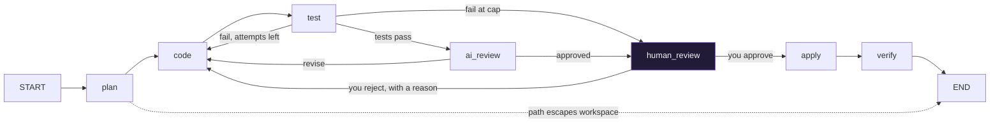

# Own Cursor: build an AI coding agent

Orion is a small coding agent you build one capability at a time with LangChain and LangGraph. It starts as a model that can only produce text and ends as an agent that researches a codebase, plans a change, writes every file, runs the tests, asks an AI reviewer, and then stops and asks **you** before anything touches disk.

You bring your own OpenRouter key. Everything else is in this repository: the agent as a Python package, eighteen lesson files you run cell by cell, a small IDE that runs the same agent with a review dialog, and the documentation to understand all of it.

**Read online:** [the curriculum site](https://Own_Cursor-tutorial-reader.vercel.app), all eighteen chapters as plain pages. To run the agent and approve its changes, use this repository.

## What the finished agent does



Seven nodes, four decisions, one graph. Every earlier chapter is a smaller version of this picture, and [docs/EVOLUTION.md](docs/EVOLUTION.md) shows it growing node by node.

## Five-minute setup

You need Python 3.13 with [uv](https://docs.astral.sh/uv/), and an [OpenRouter](https://openrouter.ai) key with a few dollars of credit. Node is only needed for the IDE's frontend.

```bash
git clone [https://github.com/sarat-coder/AI-Cursor.git]
cd own-cursor
uv sync
cp .env.example .env      # paste your OpenRouter key into .env
uv run orion doctor       # checks the key, the models, the workspace
uv run orion reset        # copies sample_project/ into workspace/
uv run pytest             # 121 offline tests, no key needed
```

`doctor` tells you exactly what is missing and how to fix it. The full key walkthrough, costs, and safety notes are in [docs/BYOK_SETUP.md](docs/BYOK_SETUP.md).

## Two ways to run it

**The lessons, from Cursor.** Open the repository folder in Cursor, open `lessons/01_hands/ch01_llm_setup.py`, put the cursor in the first cell, press Shift+Enter. [lessons/README.md](lessons/README.md) explains cells, tags, and the things to watch for.

**The app the agent works on.** `sample_project/` is a three-file Streamlit chatbot with one test file, and `workspace/` is the copy the agent edits. To see it running before and after a change:

```bash
uv run streamlit run workspace/app.py
```

It asks for your OpenRouter key in the sidebar and streams replies. Every feature the lessons add (a system prompt, a subtitle, a clear button) shows up here.

**The IDE, in a browser.**

```bash
cd orion-ide/frontend && npm install && npm run build && cd ../..   # once
uv sync --group ide
uv run orion ide            # http://localhost:8000
```

The IDE asks for your key on first load (or uses the one in `.env`), then gives you a file explorer over `workspace/`, a chat with tools, agent mode with the review dialog, the rules and skills the agent reads, and the checkpoint history. [orion-ide/README.md](orion-ide/README.md) has the details.

## What is here

| Path | What |
|---|---|
| `src/orion_agent/` | The agent: workspace jail, sandbox, tools, rules, skills, MCP, search, and the four LangGraph graphs. The lessons and the IDE both import from here; neither has agent logic of its own. |
| `lessons/` | Eighteen Python files with `# %%` cells. Lesson 1 gives the agent hands, Lesson 2 self-awareness, Lesson 3 a brain. |
| `sample_project/` | A small Streamlit chatbot with three files and a test. The agent modifies a copy of it. |
| `workspace/` | That copy. Gitignored; `uv run orion reset` remakes it. Everything the agent writes lands here and nowhere else. |
| `.cursor/rules/`, `.cursor/skills/`, `AGENTS.md`, `DESIGN.md` | The rules and skills the agent reads into its prompt. Cursor reads the same files, so you and the agent follow one rulebook. |
| `orion-ide/` | A FastAPI + React IDE that runs the package: chat, agent mode, the human gate, time travel. |
| `web/` | The Next.js curriculum site. Static; makes no model calls, so nothing on it can run the agent or approve a change. |
| `tests/` | Offline tests against a scripted stand-in for the model. |
| `docs/` | The guides below, and the six teaching drawings as SVG. |

## Documentation

Start with the first two. The rest are reference.

| Read | When |
|---|---|
| [docs/ARCHITECTURE.md](docs/ARCHITECTURE.md) | You want the whole map: the modules, the state, every graph drawn, how the IDE calls the package. |
| [docs/EVOLUTION.md](docs/EVOLUTION.md) | You want to see the agent grow from one model call to the orchestrator, chapter by chapter. |
| [docs/HUMAN_IN_THE_LOOP.md](docs/HUMAN_IN_THE_LOOP.md) | You are at Lesson 3 and want to know exactly how the pause, the review, and the resume work, and what goes wrong. |
| [docs/BYOK_SETUP.md](docs/BYOK_SETUP.md) | You are setting up your key, or wondering what a run costs. |
| [docs/EXERCISES.md](docs/EXERCISES.md) | You have run the lessons and want to change the agent: a tool, a rule, a node, a decision. |
| [docs/TROUBLESHOOTING.md](docs/TROUBLESHOOTING.md) | Something failed. |
| [docs/GLOSSARY.md](docs/GLOSSARY.md) | A word in the code or the lessons is unfamiliar. |

The `orion` command:

| Command | Does |
|---|---|
| `uv run orion doctor` | Checks Python, your key (and its spend), the two model ids, the workspace, Node |
| `uv run orion reset` | Restores `workspace/` from `sample_project/` |
| `uv run orion check-models` | Confirms `FAST` and `STRONG` exist on OpenRouter |
| `uv run orion ide` | Serves the IDE backend, and the frontend once it is built |
| `uv run orion sync-web` | Copies web-tagged lesson cells into the site's chapter files |

## The human gate, in one paragraph

Before the agent writes anything, it stops. You see the plan, every file it wants to write with a diff against what is on disk, the test output from a run on a copy of the workspace, and the AI reviewer's verdict. Approve, and it writes the files and runs the tests again. Reject with a reason, and the reason goes straight into the coder's next prompt; the loop runs again and comes back to you. In the lessons this is `interrupt()` and `Command(resume=...)`; in the IDE it is a dialog. It is the part of the course that most resembles how you will actually use a coding agent, and [docs/HUMAN_IN_THE_LOOP.md](docs/HUMAN_IN_THE_LOOP.md) is worth reading before ch16.

## Stack

Python 3.13 with uv. langchain 1.x, langgraph 1.x, langchain-mcp-adapters, pydantic 2. OpenRouter for models. Parallel Search MCP for web research. FastAPI and React (Vite) for the IDE. Next.js 15 and React 19 for the site.

## License

See [LICENSE](LICENSE).
