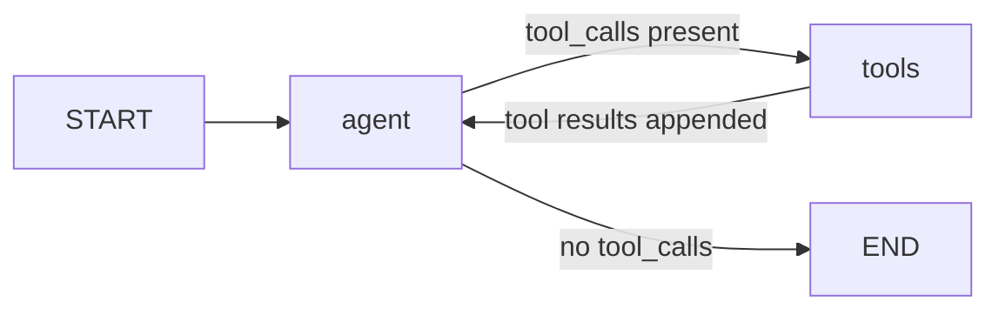
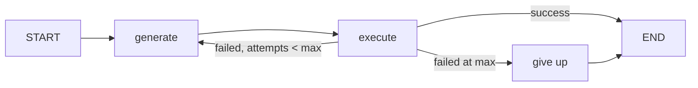
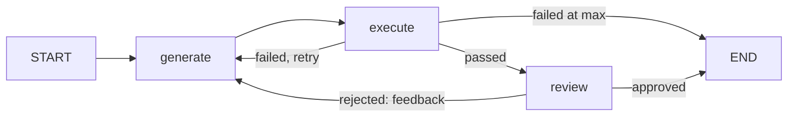
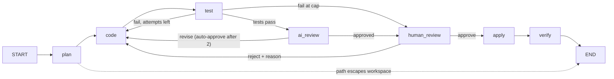
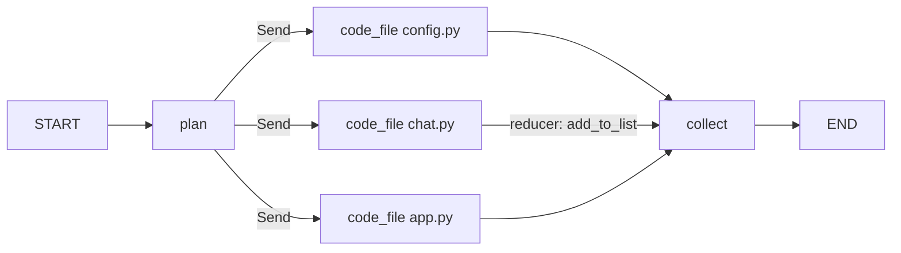
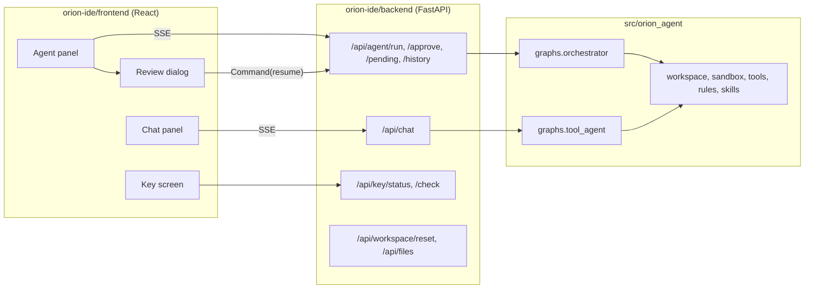

# How Orion is put together

This is the map of the repository and the logic inside it. Read it before the lessons if you like to see the whole picture first, or after Lesson 1 if you prefer to meet the pieces one at a time. Every diagram here is drawn from the code; when in doubt, the code wins.

## One idea

Everything in Orion is one graph with more nodes added to it.

The first graph has two nodes. A model decides what to do; a tool does it; the model looks at the result and decides again. Every later chapter adds a node to that loop or wraps it in another loop: a node that runs the code, a node that reviews it, a node that plans, a node that stops and asks a human, three copies of a node running at once. If you take one habit from the repository, make it this question for every new feature: *which node did we add, and which edge did we make conditional?*

## The repository

```
orion-tutorial/
├── src/orion_agent/          the agent, as a Python package
│   ├── llm.py                one function that returns a model client (OpenRouter)
│   ├── schemas.py            the Pydantic shapes: CodeOutput, ReviewResult, Plan, CodeResult
│   ├── workspace.py          the folder the agent may touch, and nothing outside it
│   ├── sandbox.py            where generated code runs (a jail, honest about its limits)
│   ├── tools.py              read, write, list, grep, glob, run_python, run_command
│   ├── rules.py              AGENTS.md and .cursor/rules/*.mdc into a system prompt
│   ├── skills.py             SKILL.md folders, loaded on demand with read_skill
│   ├── mcp.py                tools from an MCP server (Parallel Search: web_search, web_fetch)
│   ├── search.py             grep-based codebase search and a repo map
│   ├── embeddings.py         the older embed-and-search approach, kept as a footnote
│   ├── lesson.py             helpers the lesson files share, including the human-gate helpers
│   ├── cli.py                the `orion` command: doctor, reset, check-models, ide, sync-web
│   └── graphs/
│       ├── tool_agent.py     Lesson 1: the two-node agent loop
│       ├── self_correcting.py Lesson 2: generate, execute, retry; then with a reviewer
│       ├── orchestrator.py   Lesson 3: plan, code, test, AI review, human review, apply, verify
│       └── parallel.py       Lesson 3: one coder per file with Send and a reducer
├── lessons/                  eighteen Python files with `# %%` cells, run from Cursor
├── sample_project/           a small Streamlit chatbot the agent modifies
├── workspace/                the agent's copy of sample_project (gitignored; `orion reset` remakes it)
├── .cursor/rules, .cursor/skills, AGENTS.md, DESIGN.md
│                             the rules and skills the agent reads (Cursor reads the same files)
├── orion-ide/                a FastAPI + React IDE that runs the same package
├── web/                      the Next.js curriculum site (static; no model calls)
├── tests/                    offline tests against a stub model
└── docs/                     this folder
```

The rule that keeps this simple: **the package owns the logic; everything else calls it.** The lessons import from `orion_agent`. The IDE backend imports from `orion_agent`. Neither has agent code of its own. Change a node in `graphs/orchestrator.py` and the lessons, the IDE, and the tests all change with it.

## The pieces, bottom up

### The model

`get_llm(model)` in `llm.py` returns a LangChain `ChatOpenAI` pointed at OpenRouter. Two model ids are fixed: `FAST` for the many cheap calls in Lessons 1 and 2, `STRONG` for planning and review in Lesson 3. `structured(llm, Schema)` wraps a model so it returns a validated Pydantic object instead of prose; that is how code, plans, and reviews come back as fields.

### Tools

A tool is a plain function with `@tool`. The decorator builds a schema from the name, the type hints, and the docstring, and the schema is all the model ever sees. `make_tools(ws, sandbox)` in `tools.py` builds seven of them bound to one workspace and one sandbox.

### The workspace jail

`Workspace` in `workspace.py` resolves every path against its root and raises if the result would leave it. Every tool goes through it, so an escape comes back to the model as an `Error: ...` string rather than a file outside the project.

### The sandbox

`LocalSandbox` runs generated code with the common accidents prevented: isolated interpreter, scrubbed environment, temporary directory, and a timeout that returns a result instead of raising. It does not block the network or limit memory; the module docstring says so and names the real sandboxes shipped agents use.

### Context from files

`load_rules(root, for_path)` assembles a system prompt from `AGENTS.md` and the `.cursor/rules/*.mdc` files whose globs match the target path. `load_skills(root)` finds every `SKILL.md`; the model gets one line per skill and loads a body with `read_skill(name)` only when it matches the task. `aget_mcp_tools()` connects to an MCP server and returns tools that bind like any other.

## The graphs

Each graph is a LangGraph `StateGraph`: a **state** (a dictionary that flows between nodes), **nodes** (functions that take the state and return the fields they changed), and **edges** (which node runs next). A **conditional edge** is a function that reads the state and returns the name of the next node.

### 1. The agent loop (`graphs/tool_agent.py`)



`agent` calls the model with the tools bound. `tools` is a prebuilt `ToolNode` that runs every tool call in the last message and appends the results. `route` is the one conditional edge. The state is `MessagesState`: a list of messages with a reducer that appends. This is the whole of Cursor's chat, of Claude Code, of Codex. The IDE's chat panel runs exactly this graph with every tool, the rules, and the skills catalog.

### 2. The self-correcting loop (`graphs/self_correcting.py`)



`generate` asks for `CodeOutput`. `execute` runs it in the sandbox. If it failed, the error goes into the next generate prompt: "the previous attempt failed with this error, fix it." That one line is the whole mechanism. Attempts are counted once for the whole system, not per node.

### 3. With a reviewer (`build_full_agent`, same file)



The reviewer runs after execute, on code that works, so its opinion is never spent on code that does not run. Its feedback goes into the generate prompt the same way the error did.

### 4. The orchestrator (`graphs/orchestrator.py`)



Seven nodes, four conditional routes:

| Node | What it does | Returns |
|---|---|---|
| `plan` | Runs the agent loop with grep, glob, read, and read_skill to research the codebase, then asks the strong model for a `Plan`. Checks every planned path against the workspace. | `plan`, `file_tasks`, `codebase_context`, counters reset |
| `code` | One structured call per file task. The prompt folds in the rules for that path, the codebase context, and whichever feedback exists: the last test output, the reviewer's objections, or the human's reason. | `generated_code` |
| `test` | Writes the proposed files into a snapshot copy of the workspace and runs pytest there (or smoke-imports the changed modules if there are no tests). | `test_output`, `test_attempts`, status |
| `ai_review` | Shows the reviewer only the files and the test output, with no memory of how they were written. Auto-approves after two rejections and says so. | `review_result`, `review_attempts`, status |
| `human_review` | `interrupt()` with the plan, every file, a diff per file, the tests, and the review. Resumes with the decision. | `human_decision`, `human_feedback`, counters reset on reject |
| `apply` | Writes the files into the real workspace. | status |
| `verify` | Runs the tests once more on the real workspace. | `test_output`, `done` or `verify_failed` |

The state, in full:

| Field | Set by | Read by |
|---|---|---|
| `feature_request` | you | plan |
| `codebase_context` | plan | code |
| `plan`, `file_tasks` | plan | code, human_review |
| `generated_code` | code | test, ai_review, human_review, apply, verify |
| `test_output`, `test_attempts` | test, verify | route_after_test, code, ai_review, human_review |
| `review_result`, `review_attempts` | ai_review | route_after_review, code, human_review |
| `human_decision`, `human_feedback` | human_review | route_after_human, code |
| `status`, `error` | every node | every route |

The two feedback loops are the heart of it. Failing test output and reviewer objections go back into the coder's prompt; the coder does not remember the last round, it reads it. A human reject does the same and resets both counters so the reviewer looks at the new code fresh.

### 5. Parallel coders (`graphs/parallel.py`)



The plan lists three files; they are independent. `fan_out_to_coders` returns one `Send` per file task, and LangGraph runs `code_file` once per Send at the same time. Their outputs merge through a reducer on `generated_code`: `existing + new`. It is the only reducer written by hand in the repository, and `MessagesState` was using one all along.

## The human gate, in one paragraph

The graph is compiled with a checkpointer, so the state is saved after every node under a thread id. `interrupt(payload)` inside `human_review_node` ends the run and hands the payload back. `Command(resume=decision)` on the same thread id restarts that node with the decision in hand. That is the entire mechanism; [HUMAN_IN_THE_LOOP.md](HUMAN_IN_THE_LOOP.md) walks it step by step with the mistakes people make.

## The IDE



The backend translates LangGraph updates into server-sent events the browser understands; it holds one compiled graph per thread in memory. `uv run orion ide` serves the backend and, once built, the frontend from one process on port 8000. The key you paste in the browser rides along with each request and is never stored server-side.

## Where to read next

- [EVOLUTION.md](EVOLUTION.md): the same graphs, in the order the lessons build them, one node at a time.
- [HUMAN_IN_THE_LOOP.md](HUMAN_IN_THE_LOOP.md): the gate, the payload, the resume, the mistakes.
- [EXERCISES.md](EXERCISES.md): fourteen changes to make while you test it.
- [diagrams/](diagrams/): the six drawings as SVG files, for slides or printing.
