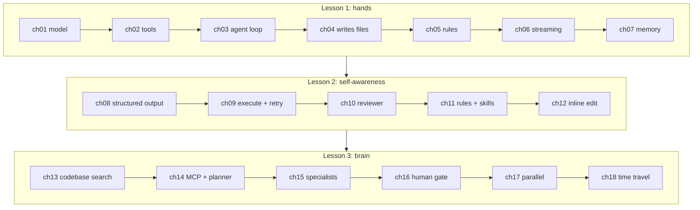
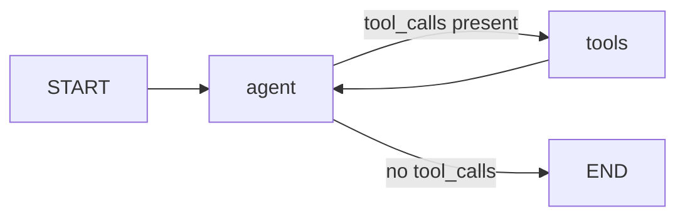
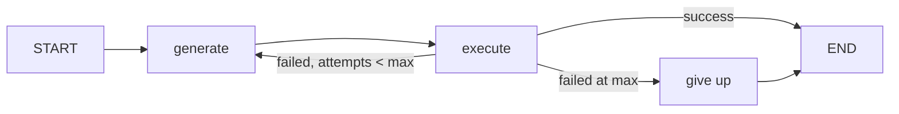
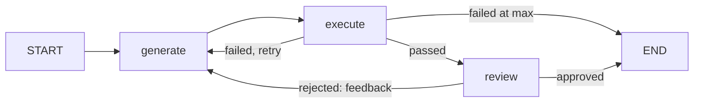
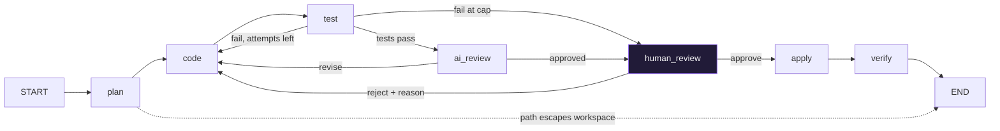
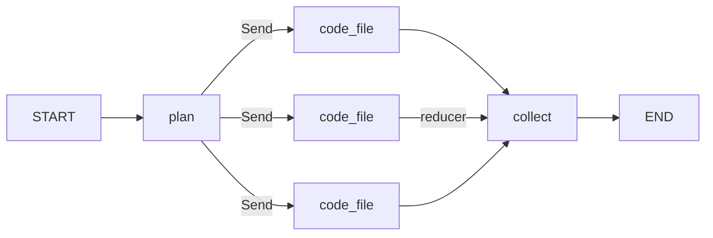

# How the Orion agent evolves

Eighteen chapters, three lessons, one graph that grows. This page follows the agent from a single model call to the finished orchestrator and, at each step, names the node or edge that was added and the chapter that adds it. Read it beside [ARCHITECTURE.md](ARCHITECTURE.md), which shows the finished shapes.

The analogy the course uses: think of the agent as a person. Lesson 1 gives it **hands** (tools, files, a chat). Lesson 2 gives it **self-awareness** (it runs its own code, sees the error, fixes it, reviews itself). Lesson 3 gives it a **brain** (it searches the codebase, plans, delegates, runs the tests, asks you before it touches disk, and does several files at once).

## The growth, in one picture



## Lesson 1: hands

### ch01: a model

```python
llm = get_llm(FAST)
llm.invoke("Say hello in one sentence.")
```

Text in, text out. The model cannot read a file, search the web, or run code. Everything that follows is what you wrap around a thing that can only produce text.

### ch02: tools

A tool is a function with `@tool`. The decorator turns the name, type hints, and docstring into a schema; the model sees the schema and never the body. Three tools: `read_file`, `write_file`, `list_directory`. Every path goes through the workspace jail.

### ch03: the agent loop, the first graph



**Added: two nodes and one conditional edge.** `bind_tools` on its own only makes the model *decide* which tool to call; the answer comes back empty with a `tool_calls` list. Nothing ran. The graph is what runs it and shows the model the result, and loops. `build_tool_agent` in `graphs/tool_agent.py` is twenty lines and it is the shape every later graph keeps.

### ch04: it writes code

**Added: nothing to the graph.** The same loop, asked to create a calculator module, calls `write_file`. The teaching point is that the agent is already a coding agent; what it lacks is any way to know whether the code works.

### ch05: rules from files

**Added: a system prompt, assembled from files.** `load_rules(root, for_path)` reads `AGENTS.md` and the `.cursor/rules/*.mdc` files whose globs match the target path. The same agent gets stricter rules for a test file than for app code, and nobody pasted a prompt.

### ch06: streaming

**Added: a display concern, not an agent concern.** `astream_events` hands out tokens and tool starts as they happen. The lessons switch it off afterwards to keep traces readable; the IDE's chat uses it.

### ch07: memory across turns

**Added: a checkpointer.** Two ways to remember: carry the message list yourself, or compile with `checkpointer=InMemorySaver()` and pass a `thread_id`. The checkpointer saves the state after every node, keyed by thread. It looks like a convenience here. In Lesson 3 it is what makes the human gate and time travel possible.

## Lesson 2: self-awareness

### ch08: structured output

**Added: typed answers.** `structured(llm, CodeOutput)` makes the model return an object with `.code` and `.explanation` instead of prose with a code fence somewhere in it. Every specialist in Lesson 3 returns a typed object; this is where that starts.

### ch09: execute and retry



**Added: a node that runs the code, a custom state, and a three-way conditional edge.** `LocalSandbox` runs the code in isolated mode with a scrubbed environment and a timeout. `AgentState` carries `task`, `code`, `error`, `attempts`, `status`. `generate` reads `state["error"]` and, if present, adds "the previous attempt failed with this error, fix it" to the prompt. Feedback goes back into the prompt of the node that acts. Bounded at three attempts, because if a model cannot fix something in three tries the problem is the environment or the task, and a person should look. That sentence is the seed of the human gate.

### ch10: a reviewer



**Added: a review node after execute.** Execute proves the code runs; it does not prove the code is good. The reviewer returns `ReviewResult(approved, feedback)` and the feedback goes into the generate prompt exactly the way the error did. The order is a cost decision: review after execute means the reviewer runs once, on code that works.

### ch11: rules and skills

**Added: skills, loaded on demand.** Rules are context you always pay for. A skill is a `SKILL.md` whose one-line description sits in the prompt and whose body arrives only when the model calls `read_skill(name)`. The trace shows the model choosing to load one.

### ch12: inline edit

**Added: nothing to the graph.** Selecting code and pressing Cmd+K in Cursor copies the selection into context with your instruction. Here that is the task string carrying the existing code. Same agent, different input.

## Lesson 3: brain

### ch13: finding code

**Added: grep, glob, and read as the way to find code.** `search_codebase` greps for each word in the query and ranks files by hits; `repo_map` lists every file with its top-level names. The searching agent is the ch03 loop with three different tools. The embeddings cell stays as a footnote: every shipped coding agent moved from an index to agentic search.

### ch14: the toolkit, MCP, and the planner

**Added: tools from a server, and a plan as a typed object.** `aget_mcp_tools()` connects to Parallel's MCP server and returns `web_search` and `web_fetch`; they bind like any other tool. `run_command` takes an argv list, no shell. The planner returns `Plan(summary, file_tasks)` where each task names a file, an action, and a description. `OrchestratorState` is printed for the first time: every field the finished agent will carry.

### ch15: three specialists

**Added: the prompts.** The planner researches first (the ch03 loop with grep, glob, read, and read_skill) and checks every planned path against the workspace. The coder's prompt, built by `build_code_prompt`, folds in the rules for the path, the codebase context, and whichever feedback exists: failing tests, the reviewer's objections, or the human's reason. The reviewer sees only the files and the test output, with no memory of how they were written. Print the coder prompt with a feedback section in it and the loop stops being a diagram.

### ch16: the human gate, the finished graph



**Added: test, human_review, apply, verify, and the routes between them.** Tests run on a snapshot copy of the workspace before the reviewer sees anything. Only passing code goes to the AI reviewer; only reviewed code goes to you. `interrupt()` freezes the run with the plan, every file with its diff, the tests, and the review; `Command(resume=...)` continues it. Approve writes the files and runs the tests once more. Reject carries your reason into the coder's prompt and resets both counters. Seven nodes, four conditional routes, and every one of them is the ch03 idea: a node, and a function that reads the state and picks the next node. [HUMAN_IN_THE_LOOP.md](HUMAN_IN_THE_LOOP.md) has the details.

### ch17: parallel coders



**Added: `Send` and a reducer.** The plan lists three independent files, so `fan_out_to_coders` returns one `Send` per task and three copies of `code_file` run at once. Their outputs merge through `add_to_list` on `generated_code`. Two state shapes: what the system knows (`ParallelState`) and what one copy needs (`SingleFileState`).

### ch18: time travel

**Added: nothing. The checkpointer from ch07 pays off.** `agent.get_state_history(config)` walks every step of a thread: what was planned, generated, tested, reviewed, and decided. A second feature streams node by node and pauses at the gate like the first. This is how you debug an agent.

## The same growth as a table

| Chapter | Node or edge added | Pattern name |
|---|---|---|
| ch03 | `agent`, `tools`, `route` | Agent loop, tool use |
| ch07 | checkpointer and thread id | Memory |
| ch09 | `execute`, `should_retry` | Self-correction, bounded retries |
| ch10 | `review`, `after_review` | Reflection |
| ch11 | `read_skill` tool and the catalog | Progressive disclosure |
| ch13 | grep, glob, read as tools | Knowledge retrieval |
| ch14 | MCP tools, `Plan` | Tools as configuration, planning |
| ch15 | planner, coder, reviewer prompts | Multi-agent |
| ch16 | `test`, `human_review`, `apply`, `verify` | Human-in-the-loop, verification |
| ch17 | `Send`, reducer | Parallelisation |
| ch18 | `get_state_history` | Time travel |

If you want to keep growing it, [EXERCISES.md](EXERCISES.md) adds a `lint` node, a third decision at the gate, and a checkpointer that survives restarts.
