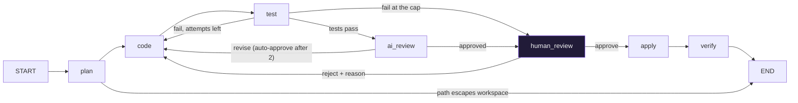
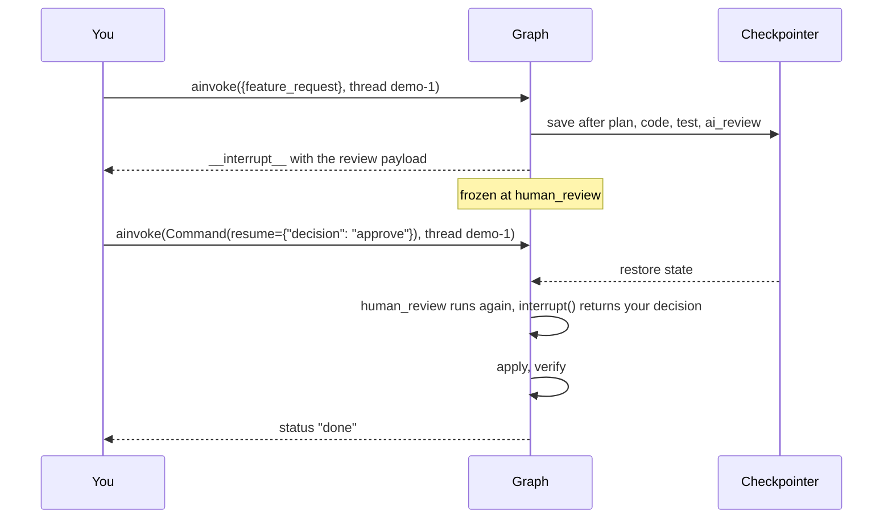

# The human gate, explained

Everything before this point in Orion runs on its own: research, plan, code, tests, an AI review. Then the graph stops and asks you. Nothing is on disk until you say yes. This page explains how that pause works, what you see, what each answer does, and the mistakes people make with it.

## Where it sits



Two roads lead to `human_review`. The usual one: the tests passed and the AI reviewer approved. The other: the tests failed three times, so instead of looping forever the graph shows you the failures and lets you decide.

## How the pause works

Three pieces, all from LangGraph:

1. **A checkpointer.** The graph is compiled with `checkpointer=InMemorySaver()`. After every node the whole state is saved under the thread id you pass in `config`.
2. **`interrupt(payload)`.** Inside `human_review_node`, this call ends the run and hands `payload` back to whoever invoked the graph. The result of `agent.ainvoke(...)` contains an `__interrupt__` key instead of a finished state.
3. **`Command(resume=value)`.** Calling `agent.ainvoke(Command(resume=...), config)` with the same thread id restarts `human_review_node` from the top. This time `interrupt()` returns your value instead of pausing.



The thread id is the whole trick. Two calls with the same id are one run; the checkpointer joins them.

## What you see

`review_payload` in `graphs/orchestrator.py` builds the payload:

| Field | What it holds |
|---|---|
| `plan` | The planner's one-paragraph summary |
| `changes[]` | One entry per file: `filepath`, `action` (create or modify), `explanation`, `code` (the whole file), `diff` (unified diff against the file on disk), `preview` (first 500 characters) |
| `test_output` | pytest output from running the proposed files on a copy of the workspace |
| `review_result` | The AI reviewer's feedback, or "auto-approved after 2 rejections" |

The lessons print it; the IDE shows it in the review dialog with a Diff / Full file switch.

## What each answer does

**Approve.** The node returns `human_decision="approve"`. The router sends the run to `apply`, which writes every file into `workspace/`, then `verify`, which runs the tests on the real files. Status ends as `done`, or `verify_failed` if the real run differs from the copy.

**Reject with a reason.** The node stores your reason in `human_feedback`, sets both `test_attempts` and `review_attempts` back to zero, and routes to `code`. The coder's next prompt ends with "Human feedback (this overrides everything else): your reason". The loop runs again: code, test, AI review, and back to the gate. Counters reset so the reviewer looks at the new code fresh instead of auto-approving on used-up rounds.

`normalize_decision` accepts more than the exact word, so a typo never silently turns into a reject:

| You send | Read as |
|---|---|
| `{"decision": "approve", "feedback": ""}` | approve |
| `"approve"`, `"Approve"`, `"yes"`, `"ok"`, `True` | approve |
| `{"decision": "reject", "feedback": "rename it"}` | reject, reason "rename it" |
| `"reject"`, `"no"`, `False` | reject, no reason |
| any other text, such as `"call it TAGLINE"` | reject with that text as the reason |

In the IDE a reject without a reason is refused with a 422; in the lessons `reject()` raises `ValueError`.

## Three ways to answer

None of them is the website. The curriculum site is static; a "pending" gate there is a recording. You need this repository and your key.

**Raw LangGraph** (what ch16 C17 shows, so you see the mechanism):

```python
from langgraph.types import Command
result = run(agent.ainvoke(Command(resume={"decision": "approve", "feedback": ""}), config))
```

**The lesson helpers** (same thing, with a guard):

```python
from orion_agent.lesson import pending_review, approve, reject
pending_review(agent, config)          # the payload, or None if nothing is waiting
approve(agent, config)                 # raises RuntimeError if the agent is not waiting
reject(agent, config, "call it TAGLINE")
```

**The IDE.** Click **Approve and apply**, or **Reject**, type a reason, and **Send back with this reason**. Behind the buttons is `POST /api/agent/approve`, which resumes the same graph on the same thread.

## Mistakes and what happens

These were all tested against the stub model; the behaviour is LangGraph's, not a guess.

| Mistake | What happens | What to do |
|---|---|---|
| Re-run the feature-request cell while paused | The run starts over on the same thread and pauses again; the coder is called again | Approve or reject once. Do not re-run C15. |
| Approve twice | The second call is a no-op on a finished thread; status stays `done` | Nothing. `approve()` raises a clear error instead. |
| Resume an unknown thread id | LangGraph raises `KeyError: 'feature_request'` | Use the same `config` dict you started with. |
| Close the IDE dialog with X | The run stays paused; the panel shows **Open review** | Click it. A page reload also recovers the pause. |
| Restart the backend while paused | The paused graph lived in that process and is gone | Run the feature again. Exercise 12 in EXERCISES.md makes checkpoints survive restarts. |
| Type "Approve" with a capital | Read as approve | Nothing. Earlier versions treated it as a reject. |

## Read the diff, not just the tests

A real run while writing this page: the request was "add a PAGE_SUBTITLE constant and show it with st.caption". Round one did that and also added type hints and docstrings to every line. A reject said "only add the constant and the caption line". Round two obeyed, and the diff showed one more line: the robot emoji in `PAGE_ICON` had been rewritten as a broken escape sequence. The tests passed both times, because no test checks the icon. Only the diff showed it.

That is the whole argument for the gate. Tests catch what tests check. The diff shows everything that changed. The coder prompt now tells the model to reproduce untouched lines exactly, emoji included, but a cheaper model can still slip; you are the last check.

## Why it is worth the pause

The agent has already done everything a careful engineer would do before opening a pull request: read the code, planned, written, tested on a copy, and asked a second reviewer. The gate is the pull request. Approve is merge. Reject with a reason is a review comment, and the coder reads it before the next commit. The difference from a real pull request is that the loop closes in a minute, not a day.
